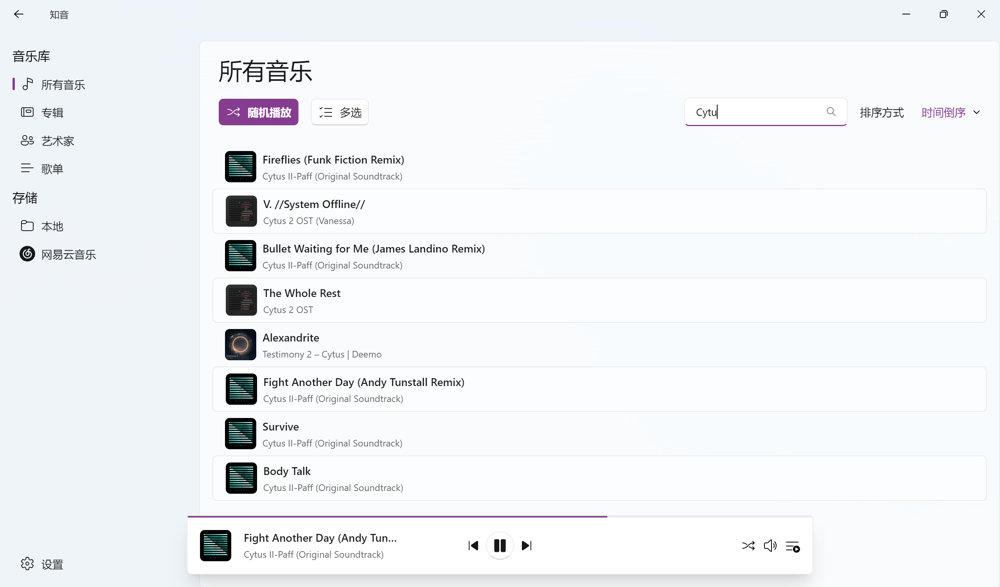
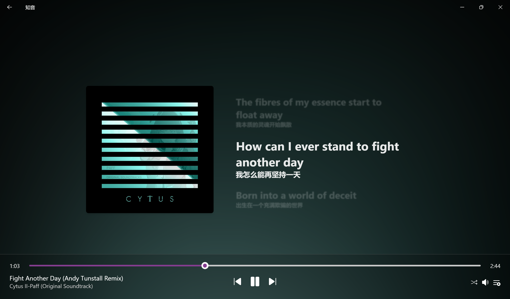

<br />

### 项目仍处于早期开发阶段，测试版本遇到问题属于正常现象，欢迎提交 issue!
---

<div align='center'>
    
    <h2>知音 Cicadas</h2>
    <p>支持多音源的音乐播放器</p>
    <p>
    <a href='https://github.com/SimonShiki/cicadas/releases'>下载</a>
    <br />
    
    
    </p>
</div>

## ✨ 特性

- 🕶️ Fluent Design - 播放器全套设计尽可能遵循 Fluent Design 标准
- 👌 基础功能 - 音乐库分类，搜索，基本播放控制，后台播放，Windows 媒体集成
- 🏠 本地音乐播放 - 多文件夹扫描 + 内嵌歌词读取
- 🎵 多音源支持 - 网易云歌单展示 + 搜索, ~~WebDAV 自动同步~~开发中
- 🪶 轻量 - 可执行文件不超过 5M
- 🦀 现代开发栈 - 前端使用 TypeScript, 播放后端使用 Rust

## ☂️ 运行需求

目前考虑了 Windows 11 的兼容性，后续可能会增加其他 Windows 版本或其它系统的支持

## 🍙 开发环境

> 本项目基于 [tauri v2](https://v2.tauri.app/) 构建，请先阅读 [Prerequisites](https://v2.tauri.app/start/prerequisites/)

```bash
git clone git@github.com:SimonShiki/cicadas.git
cd cicadas
yarn install # 或 npm install
yarn tauri dev # 开发服务器
yarn tauri build # 构建
```
